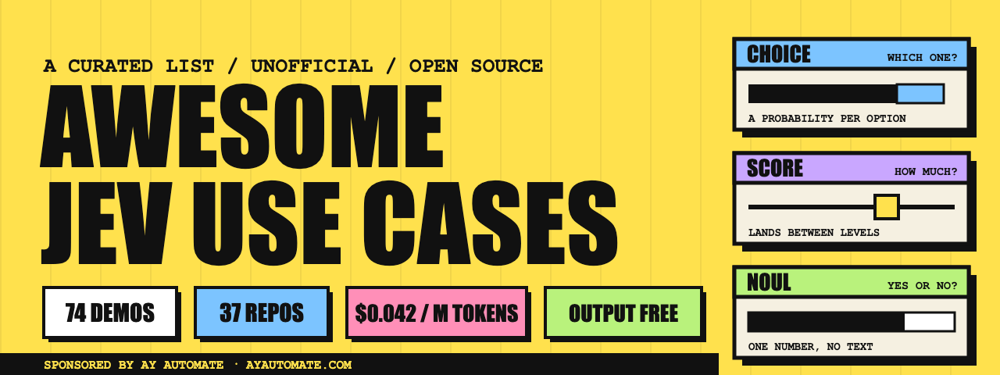

# ⚡ Awesome Jev Use Cases

<p align="center">
  
</p>

<p align="center">
  <strong>A curated collection of real-world applications, demos, repositories, patterns, and resources built around TypeSafe AI's Jev model.</strong>
</p>

<p align="center">
  <a href="https://github.com/arish096">
    
  </a>
  <a href="https://github.com/arish096/awesome-jev-use-cases">
    
  </a>
  <a href="LICENSE">
    
  </a>
</p>

---

## 🧠 About This Collection

**Awesome Jev Use Cases** is a community-focused collection of practical ideas and projects showing how **Jev** can be used for typed AI decisions instead of traditional text generation.

Jev is particularly interesting for tasks where an AI system needs to make a structured decision such as:

- 🎯 Classification
- 🔀 Routing
- 🛡️ Guardrails
- 🤖 Agent decisions
- 📊 Scoring
- 📩 Triage
- 🔎 Search and ranking
- 🎮 Real-time game decisions
- 🧩 Tool selection
- ⚙️ Automation workflows

This repository brings these ideas together so developers can **discover patterns, explore implementations, and build their own AI-powered systems**.

> **Note:** This is an unofficial community collection and is not affiliated with TypeSafe AI.

---

## 👨‍💻 About the Maintainer

Hi, I'm **[Arish Islam](https://github.com/arish096)** 👋

I'm a student and aspiring developer exploring the intersection of:

**Web Development · AI · Prompt Engineering · AI Workflows · Agentic Systems**

I enjoy turning ideas into practical projects and experimenting with modern AI tools, automation workflows, and developer technologies.

This repository is part of my exploration of the rapidly evolving AI ecosystem, especially systems where models are used not only to generate content but also to **make structured decisions inside applications and agents**.

### 🔗 Connect with me

- 💻 GitHub: [@arish096](https://github.com/arish096)
- 🌐 Portfolio: [Arish Islam Portfolio](https://arish-islam-portfolio.lovable.app/)
- 🧠 Interests: AI Agents, AI Workflows, Prompt Engineering, Web Development, Automation

---

## 🚀 Why Jev?

Traditional LLMs are excellent at generating text, but many application decisions can be represented more cleanly as structured outputs.

For example:

```text
User Request
     ↓
   Jev
     ↓
 ┌───────────────┐
 │ Choice        │
 │ Score         │
 │ Yes / No      │
 │ Confidence    │
 └───────────────┘
     ↓
Application / Agent
```

This makes Jev interesting for systems that need a **decision layer** between an input and an action.

---

## 🔥 Top Use Cases

### 🤖 AI Agents & Computer Use

Jev can act as a decision layer inside agents that need to choose:

- Which tool to use
- Which action to perform
- Which browser element to interact with
- Whether an operation is safe
- Whether an agent should continue or stop

### 🔀 Model Routing

Use Jev to decide which model, agent, or workflow should handle a particular request.

```text
User Request
      ↓
     Jev
      ↓
 ┌────┼────┐
 ↓    ↓    ↓
Fast  Pro  Agent
Model Model Workflow
```

### 🛡️ Guardrails

Jev can be used to evaluate whether an action should:

- Continue
- Ask for confirmation
- Be blocked
- Be escalated

This is especially useful in agentic workflows where every tool call should not automatically be trusted.

### 📩 Triage & Classification

Examples include:

- Email classification
- Support-ticket routing
- Intent detection
- Lead qualification
- Content moderation
- Search-result filtering

### 🎮 Games & Real-Time Systems

Decision models can also be used in environments where an application repeatedly needs to choose an action based on structured state.

---

## 🌟 Popular Demos

The original collection tracks real-world Jev demonstrations across areas such as:

| Category | Examples |
|---|---|
| 🤖 Agents & Computer Use | Browser agents, computer control |
| 🔀 Routing & Triage | Model routing, email triage |
| 🛠️ Apps & Tools | Browser extensions, developer tools |
| 📈 Content & Growth | Post scoring, content filtering |
| 🎮 Games & Real Time | Game agents and dynamic decisions |
| 🔬 Research & Data | Paper discovery and data workflows |
| 💹 Trading & Markets | Automated decision systems |

The collection currently tracks dozens of demos and open-source projects across these areas.

---

## 🧰 Open-Source Projects

This repository also collects open-source projects that experiment with Jev in real applications.

Some areas include:

- Browser automation
- Coding agents
- AI model routing
- Search
- PostgreSQL
- MCP servers
- Developer tools
- Games
- Trading experiments
- AI agent guardrails

The repository includes projects such as browser-use integrations, Claude Code tooling, Jev routers, MCP servers, search systems, and more.

---

## 🧩 Patterns to Explore

One of the main reasons for this collection is to identify **reusable AI engineering patterns**.

### Pattern 1 — Router

```text
Request
   ↓
Jev
   ↓
Choose Model
   ↓
LLM / Agent
```

### Pattern 2 — Guardrail

```text
Agent Action
     ↓
    Jev
     ↓
 ┌───┴────┐
 ↓        ↓
Allow    Block
```

### Pattern 3 — Classifier

```text
Input
  ↓
Jev
  ↓
Intent
  ↓
Workflow
```

### Pattern 4 — Agent Decision Layer

```text
Agent State
     ↓
    Jev
     ↓
Next Action
     ↓
Tool Execution
     ↓
Updated State
```

---

## 📚 What You Can Learn From This Repository

This collection is useful for developers exploring:

- AI agents
- Agentic workflows
- Prompt engineering
- AI automation
- Model routing
- Classification systems
- Structured AI decisions
- Tool calling
- MCP
- Browser automation
- AI safety and guardrails
- Real-time AI applications

For someone learning modern AI development, the important idea is not simply **"which model is smarter?"**

It is also:

> **"Where should AI make a decision inside my application?"**

---

## 🧪 Ideas to Build

Looking for a project idea?

Here are some directions inspired by the collection:

- 🤖 AI Agent Task Router
- 📧 Smart Email Triage System
- 🛡️ Agent Safety Gate
- 🔀 Multi-Model AI Router
- 🔎 Intelligent Search Selector
- 📊 Lead Qualification Agent
- 🌐 Browser Action Decision Layer
- 🧑‍💻 AI Coding Workflow Router
- 📱 AI Support Ticket Classifier
- ⚡ Real-Time Decision Engine

---

## 🗂️ Repository Structure

```text
awesome-jev-use-cases/
│
├── assets/
│   ├── cards/
│   ├── charts/
│   └── banner-v3.png
│
├── data/
│   ├── keywords.csv
│   └── youtube.csv
│
├── docs/
│   ├── README.md
│   └── ...
│
├── README.md
└── LICENSE
```

---

## 🤝 Contributing

Found an interesting Jev project?

You can contribute by:

1. Finding a relevant project or demo
2. Checking the original source
3. Adding accurate information
4. Linking to the original author/repository
5. Opening a Pull Request

Please preserve proper attribution to the original creators.

---

## ⚠️ Attribution

This repository is a **curated collection**.

Projects, demos, screenshots, links, names, and other referenced material belong to their respective creators.

Always visit the original repository or post before using a project, asset, or implementation.

The original collection describes itself as unofficial and states that entries link back to their original posts or repositories.

---

## 📜 License

This collection follows the licensing information included with the original repository.

See [`LICENSE`](LICENSE) for the complete license text.

---

## ⭐ Support

If you find this collection useful:

**⭐ Star the repository**

**🍴 Fork it**

**🤝 Contribute new projects**

**📚 Explore the referenced implementations**

---

<p align="center">

### ⚡ Explore. Learn. Build. Automate.

**Built and curated by [Arish Islam](https://github.com/arish096)**

</p>
