<div align="center">

# ⚡ Awesome Jev Use Cases

### TypeSafe AI Jev — Demos · Use Cases · Open Source · Patterns · Resources

<p>
  
  
  
  
</p>

<p>
  <a href="https://github.com/arish096">GitHub</a> ·
  <a href="https://arish-islam-portfolio.lovable.app/">Portfolio</a> ·
  <a href="#-contributing">Contributing</a>
</p>

</div>

---

<div align="center">


</div>

---

## 👋 About This Repository

**Awesome Jev Use Cases** is a curated collection of demos, projects, open-source repositories, patterns, and practical ideas built around **Jev**, TypeSafe AI's model for typed decisions.

The collection brings together real examples showing how Jev can be explored for:

- 🤖 AI agents & computer use
- 🔀 Routing & classification
- 📥 Triage & automation
- 🎯 Scoring & decision systems
- 🛡️ Guardrails
- 🎮 Games & real-time systems
- 📊 Research & data workflows
- 📈 Trading & market experiments
- 🛠️ Developer tools
- 📱 AI-powered applications

This repository is a **curated reference and learning resource**. The projects and demos belong to their respective creators.

The original collection is open source under **CC0 1.0** and is explicitly described as unofficial and not affiliated with TypeSafe.

---

## 👨‍💻 Maintained by Arish Islam

<div align="center">

<a href="https://github.com/arish096">

</a>

### Arish Islam

**Web Developer · AI & Prompt Engineering · AI-Powered Applications**

<p>
<a href="https://github.com/arish096">

</a>
<a href="https://arish-islam-portfolio.lovable.app/">

</a>
</p>

</div>

This repository is part of my exploration of AI-powered applications, prompt engineering, AI agents, automation workflows, and practical developer projects.

> **Curated by Arish Islam — Explore → Learn → Build → Share**

---

# 🧠 What Is Jev?

Jev is described in the source material as a model from **TypeSafe AI** that answers typed questions instead of primarily generating text.

Its outputs can represent structured decisions such as:

- **Choice**
- **Score**
- **Noul** — yes/no with probability

That makes Jev interesting for applications involving classification, routing, scoring, evaluation, and decision-making.

### Simple Architecture


                 ┌───────────────┐
                 │ User / App    │
                 └───────┬───────┘
                         │
                         ▼
                 ┌───────────────┐
                 │     Input     │
                 └───────┬───────┘
                         │
                         ▼
                    ┌─────────┐
                    │   Jev   │
                    └────┬────┘
                         │
              ┌──────────┼──────────┐
              ▼          ▼          ▼
           Choice      Score     Yes / No
              │          │          │
              └──────────┼──────────┘
                         ▼
                 Application Action


---

# 📊 Numbers at a Glance

The source collection was refreshed on **September 26, 2026**.

| Metric | Value |
|---|---:|
| 🎥 Demo posts tracked | **74** |
| ❤️ Total likes | **127,162** |
| 🔁 Total reposts | **6,998** |
| 💬 Total replies | **5,742** |
| 🔥 Demos over 1,000 likes | **38** |
| 📦 Open-source repos | **38** |
| ⭐ Combined repo stars | **53,259** |
| 🟦 TypeScript repos | **14** |
| 🐍 Python repos | **12** |
| 🟨 JavaScript repos | **6** |

### Demo Areas

| Area | Demos |
|---|---:|
| Content & Growth | 18 |
| Apps & Tools | 17 |
| Agents & Computer Use | 14 |
| Triage & Routing | 9 |
| Games & Real Time | 7 |
| Research & Data | 7 |
| Trading & Markets | 2 |

These figures come from the source's September 26, 2026 refresh.

---

# 🔥 Top 30 Jev Demos

> **The complete visual gallery is preserved below. Click any card to open the original creator's post.**

<div align="center">

<a href="https://x.com/tamarajtran/status/2100694549362553153">
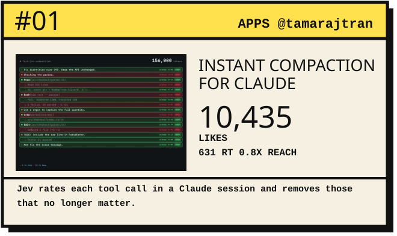
</a>
<a href="https://x.com/gregpr07/status/2100411066966749359">
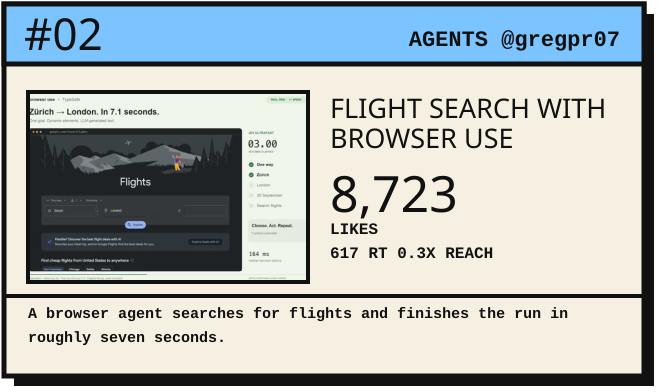
</a>

<a href="https://x.com/RBilgil/status/2100976648552169805">
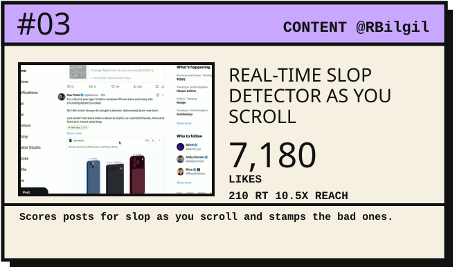
</a>
<a href="https://x.com/TheMattBerman/status/2100654891756589230">
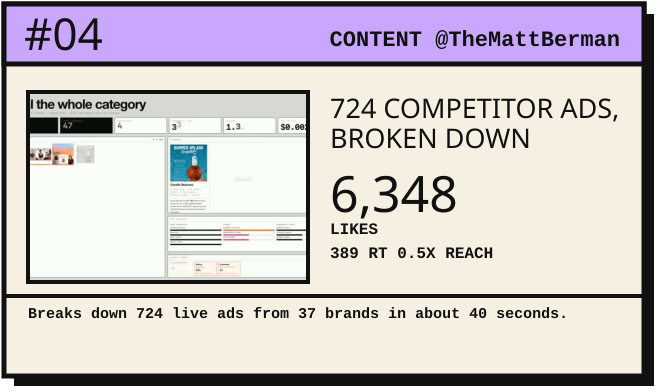
</a>

<a href="https://x.com/instantricecook/status/2100814590300889426">
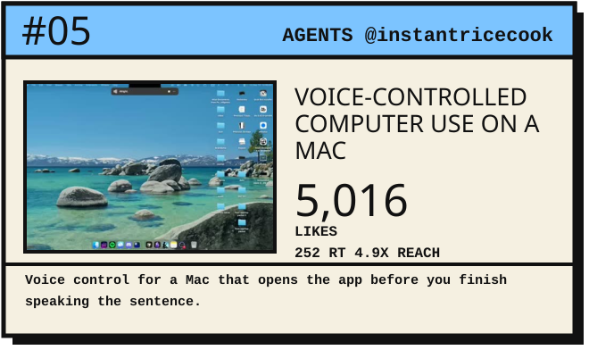
</a>
<a href="https://x.com/jarrodwatts/status/2100356151468585346">
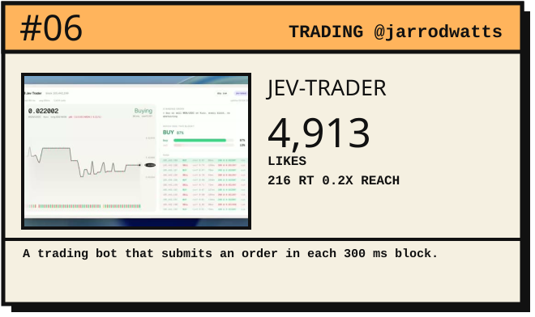
</a>

<a href="https://x.com/CompleteSkeptic/status/2099925687465570372">
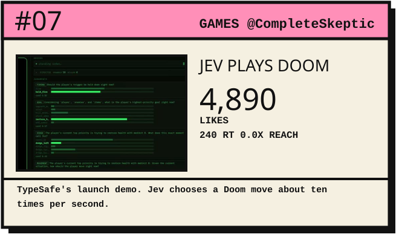
</a>
<a href="https://x.com/jackcheng/status/2100729670991802386">
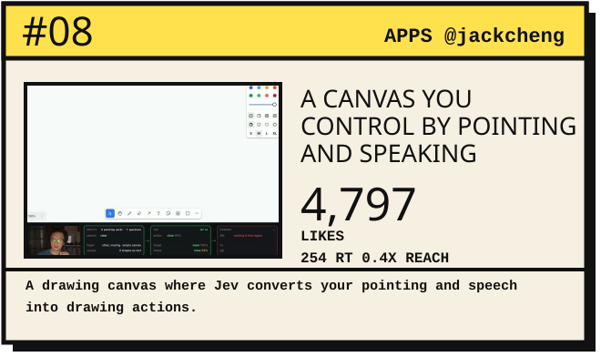
</a>

<a href="https://x.com/_MaxBlade/status/2100967959879471519">
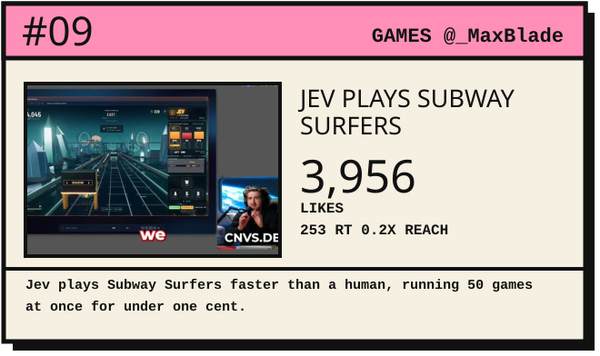
</a>
<a href="https://x.com/iam_zachi/status/2100529273186472318">
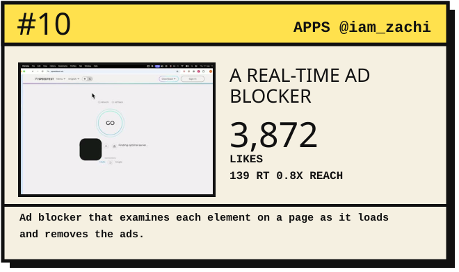
</a>

<a href="https://x.com/rileybrown/status/2100404532119269426">
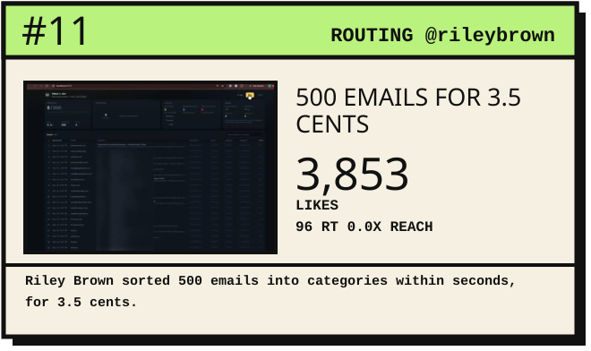
</a>
<a href="https://x.com/maubaron/status/2100738237237002706">
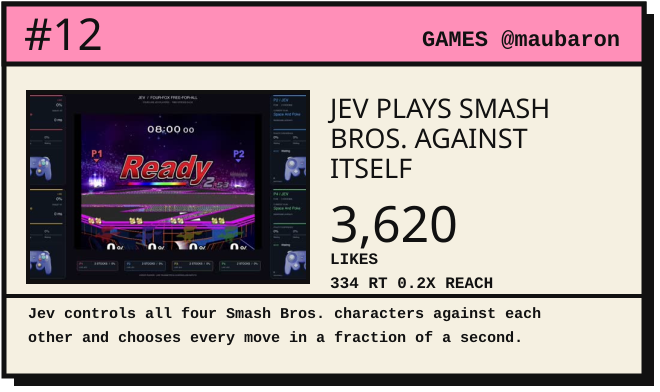
</a>

<a href="https://x.com/ryanvogel/status/2100042788851101842">
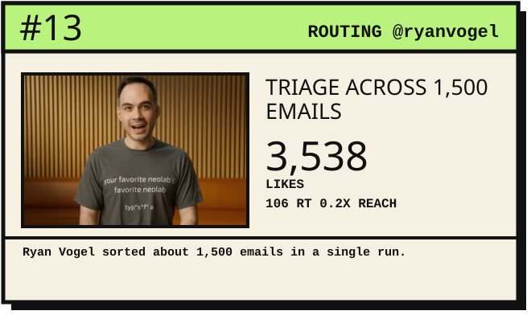
</a>
<a href="https://x.com/romanbuildsaas/status/2100891604735099103">
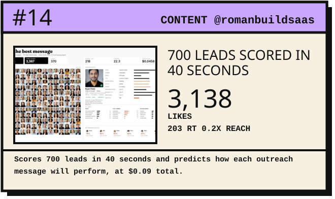
</a>

<a href="https://x.com/faadilhshaik/status/2100086301894881578">
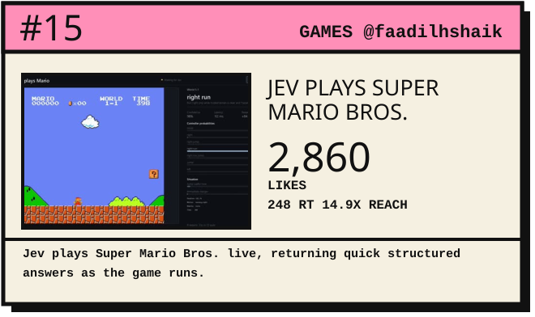
</a>
<a href="https://x.com/iam_zachi/status/2100679300756435135">
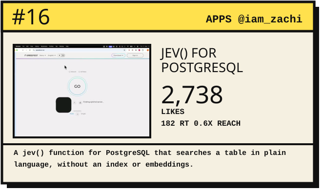
</a>

<a href="https://x.com/HugoDuprez/status/2100953089003921543">
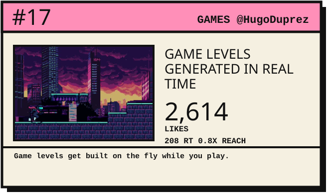
</a>
<a href="https://x.com/dabit3/status/2100756930054504776">
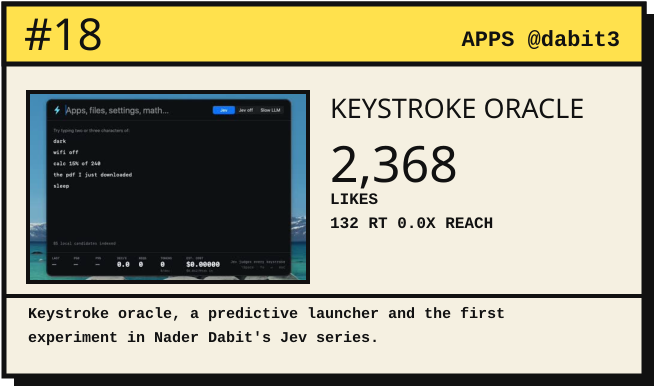
</a>

<a href="https://x.com/vinnylarouge/status/2100170846346097083">

</a>
<a href="https://x.com/nutlope/status/2100426999546184123">
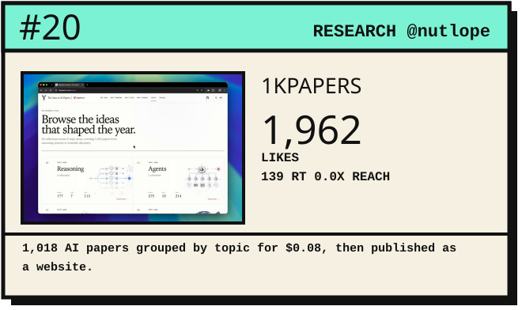
</a>

<a href="https://x.com/ephraimduncan/status/2100454070536351824">
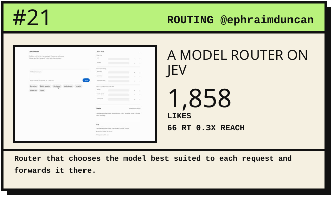
</a>
<a href="https://x.com/milindlabs/status/2100631847155994852">
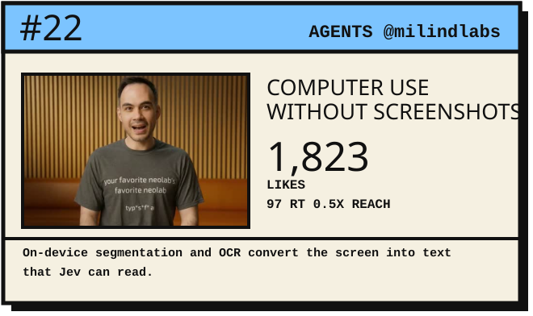
</a>

<a href="https://x.com/danshipper/status/2099947471518474522">
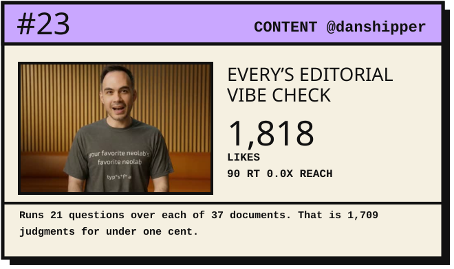
</a>
<a href="https://x.com/sarvagya_kul/status/2100980770206879849">
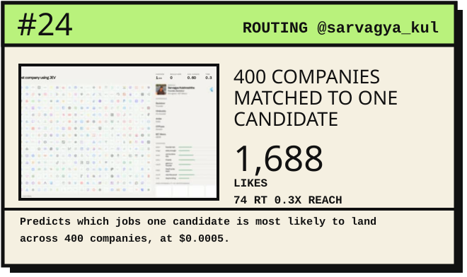
</a>

<a href="https://x.com/abolbuild/status/2100523868913807410">
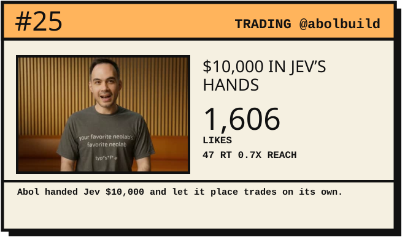
</a>
<a href="https://x.com/_MaxBlade/status/2100967959879471519">
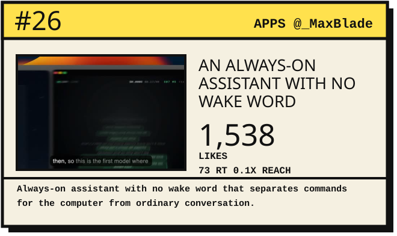
</a>

<a href="https://x.com/robj3d3/status/2100722975645598191">
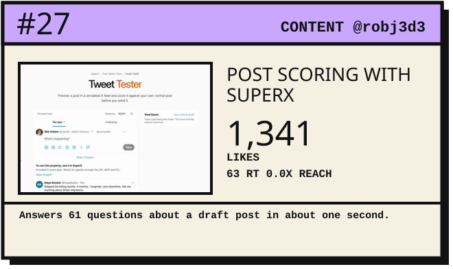
</a>
<a href="https://x.com/robj3d3/status/2101074194260000982">
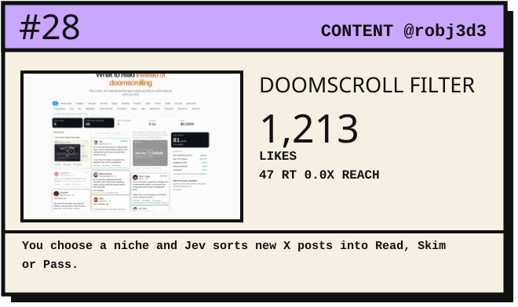
</a>

<a href="https://x.com/dabit3/status/2100780008193020049">
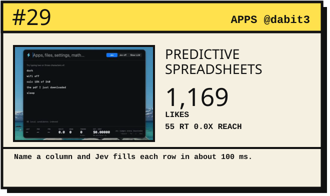
</a>
<a href="https://x.com/leojrr/status/2100470174130250127">
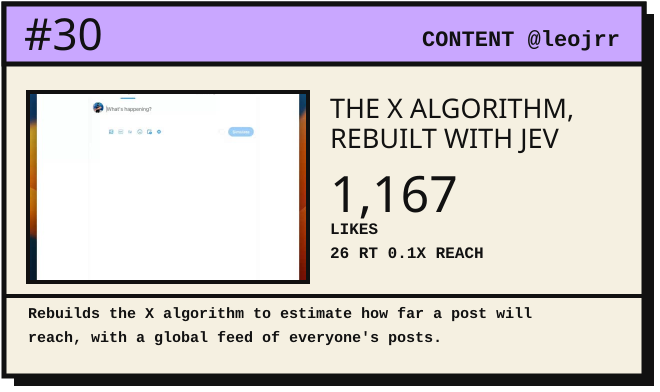
</a>

</div>

The original source contains these 30 visual cards and links each card to the corresponding original post.

---

# 🧩 What These Demos Show

The gallery covers a wide range of patterns.

### 🔀 Routing


Incoming Request
       ↓
      Jev
       ↓
┌──────┼──────┐
▼      ▼      ▼
Sales  Support Other


### 📥 Triage


Emails / Tasks
      ↓
   Jev
      ↓
Priority Decision
      ↓
Action Queue


### 🎯 Scoring

```text
Input
  ↓
Jev
  ↓
Score
  ↓
Rank / Filter


### 🤖 Agent Control


User
 ↓
Agent
 ↓
Jev Decision
 ↓
┌────────┬────────┐
▼        ▼        ▼
Search   Browse   Execute


---

# 🛠️ Practical Use Cases

| Use Case | What Jev Can Help Decide |
|---|---|
| 🎫 Support Routing | Which team should handle a request |
| 📧 Email Triage | Which messages need attention |
| 🎯 Lead Scoring | Which leads deserve priority |
| 🔀 Model Routing | Which model should process an input |
| 🛡️ Guardrails | Whether an action should continue |
| 🔎 Content Filtering | Which content needs review |
| 🤖 Agent Control | What an agent should do next |
| 🎮 Interactive Systems | Which action should happen next |
| 📊 Data Classification | Which category an input belongs to |

---

# 💡 Build Your Own

Here are some project ideas inspired by the patterns in this collection.

### 01. AI Support Router


Customer Message
       ↓
      Jev
       ↓
Billing / Technical / Account
       ↓
Support Workflow


### 02. AI Lead Scorer


Lead Information
       ↓
      Jev
       ↓
    Score
       ↓
Sales Priority


### 03. AI Content Filter


Content
   ↓
Decision Layer
   ↓
Safe / Review / Reject


### 04. Multi-Model Router


Request
   ↓
Decision Layer
   ↓
┌──────────┬──────────┬──────────┐
▼          ▼          ▼
Fast       Reasoning  Vision
Model      Model      Model


---

# 📚 What You Can Learn

This repository is especially useful for exploring:

- AI application architecture
- Structured AI outputs
- Prompt engineering
- AI agents
- Classification
- Routing
- Scoring
- Automation
- API-based AI systems
- Open-source research
- Developer tooling

---

# 📁 Repository Structure


awesome-jev-use-cases/
│
├── assets/
│   ├── banner-v3.png
│   ├── sponsor.png
│   ├── chart-top-demos.svg
│   │
│   └── cards/
│       ├── 01-instant-compaction.svg
│       ├── 02-browser-use-flights.svg
│       ├── 03-rbilgil-slop-detector.svg
│       ├── ...
│       └── 30-x-algorithm-simulator.svg
│
├── docs/
│   └── README.md
│
├── README.md
└── LICENSE


---

# 🔍 How to Explore

### 1️⃣ Start with the 30 featured demos

Open the visual cards above and inspect the original implementations.

### 2️⃣ Identify the pattern

Ask:

- Is this classification?
- Is this routing?
- Is this scoring?
- Is this triage?
- Is this agent control?

### 3️⃣ Study the implementation

Follow the original repository or post.

### 4️⃣ Build your own version

Adapt the underlying idea to your own application.

### 5️⃣ Contribute

Share useful Jev-related projects and discoveries.

---

# 🤝 Contributing

Contributions are welcome.

You can contribute:

- 🆕 New Jev demos
- 📦 Open-source repositories
- 💡 New use cases
- 🔧 Documentation improvements
- 🔗 Broken-link fixes
- 📊 Updated statistics
- 🎨 Visual improvements

### Git workflow


git checkout -b feature/add-jev-project

git add .

git commit -m "Add new Jev use case"

git push origin feature/add-jev-project


Then open a Pull Request.

---

# ⚠️ Attribution & Disclaimer

This repository is a **curated collection**.

The maintainer does **not claim ownership of the individual projects, demos, screenshots, or posts** shown in the gallery.

Each demo card links to its original creator/source. The original collection also states that it is unofficial and not affiliated with TypeSafe.

Please follow the license and attribution requirements of each individual project.

---

# 📜 License

This collection follows the original repository's **CC0 1.0** licensing information.

<a href="LICENSE">

</a>

See [`LICENSE`](LICENSE) for the complete license text.

---

# ⭐ Support

If this repository helps you:

<p align="center">

⭐ **Star the repository**

💡 **Suggest a use case**

🐛 **Open an issue**

🤝 **Contribute**

</p>

---

<div align="center">

## ⚡ Explore · Learn · Build · Share

### Maintained by Arish Islam

**Web Developer · AI & Prompt Engineering · AI-Powered Applications**

<p>
<a href="https://github.com/arish096">

</a>
<a href="https://arish-islam-portfolio.lovable.app/">

</a>
</p>

</div>
